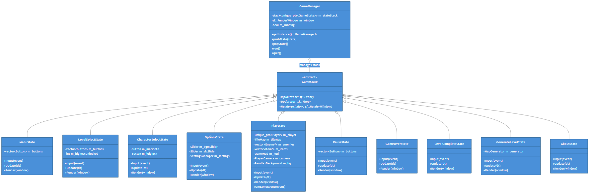
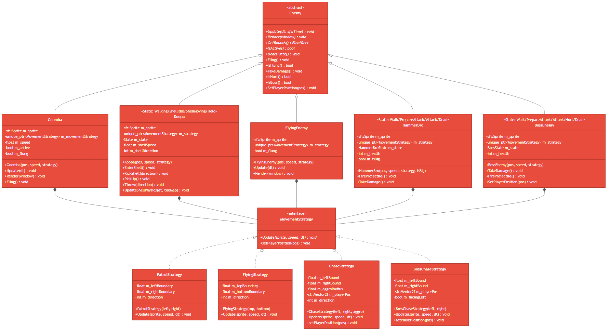
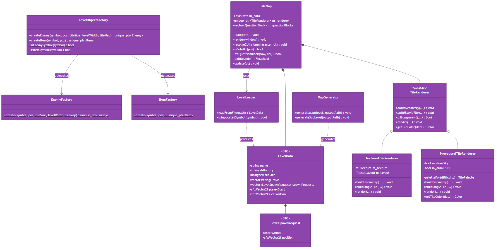
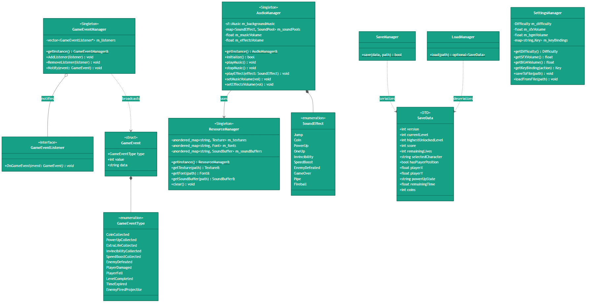
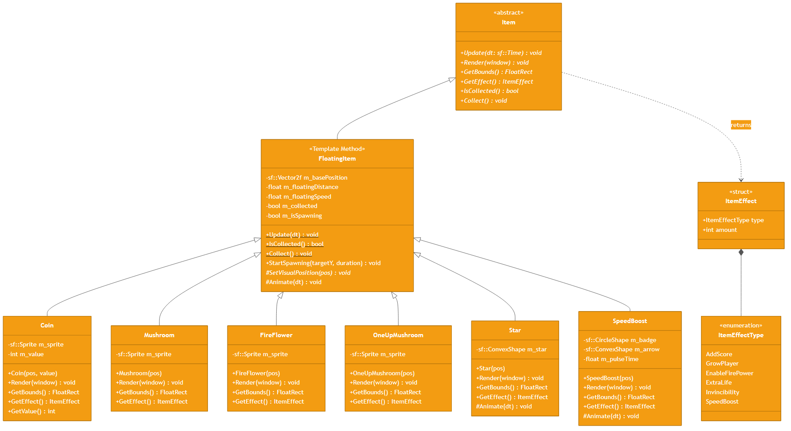
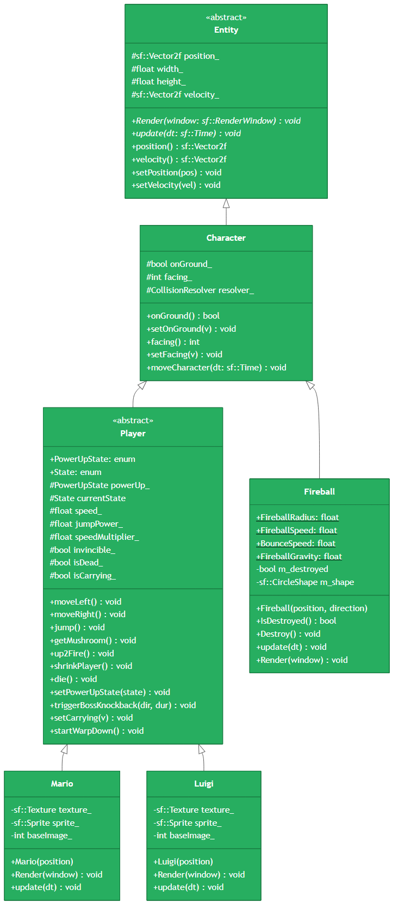

# CS202 Programming System — Final Project Report
## Super Mario Flashback | Group 5

| | |
|---|---|
| **Course** | CS202 Programming System |
| **Project** | Super Mario Flashback |
| **Language** | C++17 |
| **Library** | SFML 2 (Simple and Fast Multimedia Library) |
| **Build System** | CMake |

### Team Members

| No. | Student ID | Full Name | Role |
|:---:|:---:|---|---|
| 8 | 25125015 | Nguyen Pham Duc Huy | Core Systems, Architecture, Persistence, Procedural Generation |
| 9 | 25125018 | Nguyen Minh Khang | Level Design, Castle Sequence, Physics Edge Cases |
| 16 | 25125034 | Tran Quyet Thang | Enemy AI, Boss System, Tile Collision, Audio |
| 22 | 25125052 | Vo Thanh Dat | Koopa Shell Mechanics, Menu UI, Enemy Refactoring |

---

## 1. AI Usage Declaration

**Tool(s) Used**: GitHub Copilot (code completion), Gemini (architecture review, documentation proofreading).

**Scope of AI Assistance**:
- Generating boilerplate code for repetitive SFML patterns (sprite setup, event handling).
- Reviewing and suggesting improvements to documentation and comments.
- Proofreading this report for grammatical correctness.

**What the Team Built Manually**:
The core Object-Oriented architecture — including all design pattern integrations, game physics, collision resolution, level parsing, procedural generation, enemy AI state machines, the full persistence system, and all five levels — was entirely conceived, designed, and implemented by the team members themselves. AI was not used to bypass any learning objectives of the course.

---

## 2. Demo Video Links

| Content | Link |
|---|---|
| Full Gameplay Demo (All 3 manual levels + Level 4 procedural) | `https://youtu.be/EXjN6fgQRZw?si=Lmf81SBxOXa-5IpL` |
| Feature Showcase (Power-ups, Boss, Pipes, Shell mechanics) | `https://youtu.be/EXjN6fgQRZw?si=Lmf81SBxOXa-5IpL` |
| Build & Run Walkthrough | `https://youtu.be/EXjN6fgQRZw?si=Lmf81SBxOXa-5IpL` |

---

## 3. Project Overview

**Super Mario Flashback** is a 2D side-scrolling platformer game in the classic Mario style, developed as the team's CS202 final project. The game is designed from scratch using **C++17** and **SFML 2**, without using any existing game engines or frameworks. The project emphasizes robust **Object-Oriented Design** and the systematic application of **Design Patterns** to achieve a maintainable, extensible codebase.

### 3.1 Architecture Summary

The project is organized into the following subsystems, each corresponding to a directory in `include/` and `src/`:

| Subsystem | Responsibility |
|---|---|
| **States** (`GameState`, `MenuState`, `PlayState`, …) | Full game lifecycle management via State Pattern |
| **Entities** (`Player`, `Enemy`, `Item`, projectiles) | All game actors with inheritance hierarchies |
| **Strategies** (`MovementStrategy` family) | Pluggable AI movement behaviors |
| **Factories** (`EnemyFactory`, `ItemFactory`, `LevelObjectFactory`) | Symbol-to-object translation |
| **Levels** (`LevelLoader`, `TileMap`, `MapGenerator`, renderers) | Map parsing, collision, and rendering |
| **Events** (`GameEventManager`, `GameEventListener`) | Observer-based game event bus |
| **Resources** (`ResourceManager`) | Singleton asset cache |
| **Audio** (`AudioManager`) | Singleton sound/music manager |
| **Persistence** (`SaveManager`, `LoadManager`, `SaveData`) | Versioned save/load system |
| **UI** (`Button`, `GameHud`, `Slider`, `ParallaxBackground`) | All HUD and menu interface components |
| **Camera** (`PlayerCamera`) | Smooth, world-bounded camera follow |
| **Commands** (`ICommand`, `LambdaCommand`, `PopStateCommand`) | Command Pattern for decoupled button actions |

---

## 4. Applied Design Patterns & Reasoning

### 4.1 State Pattern

**Files**: `include/GameState.hpp`, `include/GameManager.hpp`, all `*State.hpp` files.

**Structure**: `GameManager` maintains a `std::stack<std::unique_ptr<GameState>>`. Each screen in the game (`MenuState`, `LevelSelectState`, `CharacterSelectState`, `OptionsState`, `PlayState`, `PauseState`, `GameOverState`, `LevelCompleteState`, `GenerateLevelState`, `AboutState`) is a concrete implementation of the abstract `GameState` interface.

```
GameState (abstract)
  ├── MenuState
  ├── LevelSelectState
  ├── CharacterSelectState
  ├── OptionsState
  ├── PlayState
  ├── PauseState
  ├── GameOverState
  ├── LevelCompleteState
  ├── GenerateLevelState
  └── AboutState
```

**Why This Pattern?** Without the State Pattern, the main game loop would require a massive `switch` or `if-else` chain checking which screen is active, which screen should render, which handles input. This violates the Open/Closed Principle — adding a new screen would require modifying the core loop. With the State Pattern, each screen is self-contained. `GameManager::pushState()` and `popState()` allow seamless transitions (e.g., opening Pause over Play, then returning to Play exactly where it left off) without any screen knowing about others.

**Key Design Decisions**:
- A **stack** (not a simple pointer) is used so that `PauseState` can be pushed *on top of* `PlayState` and popped to return cleanly without recreating the gameplay session.
- The `GameManager` itself is a **Singleton** ensuring one window, one render loop, and one event queue for the entire application.



---

### 4.2 Strategy Pattern

**Files**: `include/entities/strategies/MovementStrategy.hpp` and all subclasses.

**Structure**: `MovementStrategy` is a pure interface with a single `Update(sf::Sprite&, float speed, sf::Time dt)` virtual method. Four concrete strategies are implemented:

| Strategy | Behavior |
|---|---|
| `PatrolStrategy` | Horizontal left/right patrol within fixed X boundaries |
| `FlyingStrategy` | Vertical up/down oscillation within fixed Y boundaries |
| `ChaseStrategy` | Horizontal patrol with player-aggro radius: chases the player within range |
| `BossChaseStrategy` | Pursues the player directly along X with a small dead-zone to prevent jitter |

Each concrete `Enemy` class owns a `std::unique_ptr<MovementStrategy>`, injected at construction through the `EnemyFactory`. Calling `enemy.SetPlayerPosition(pos)` propagates through to the strategy via a virtual `setPlayerPosition()` override.

**Why This Pattern?** Movement behavior is the most variable aspect of enemies. Without this pattern, adding a new movement type (e.g., a ChaseStrategy) would require modifying or subclassing existing enemy classes, violating Open/Closed. The Strategy Pattern means a `Goomba` and a `HammerBro` can share `PatrolStrategy` code without inheritance coupling. Behaviors compose independently of entity types.

**An illustrative example**: `HammerBro` uses `PatrolStrategy` for its walking phase but `ChaseStrategy` when near the player — the strategy can even be swapped at runtime without changing the `HammerBro` class.



---

### 4.3 Factory Pattern

**Files**: `include/factories/EnemyFactory.hpp`, `include/factories/ItemFactory.hpp`, `include/factories/LevelObjectFactory.hpp`.

**Structure**: `LevelObjectFactory` is the top-level coordinator. It delegates to `EnemyFactory::Create()` or `ItemFactory::Create()` based on whether the symbol is an enemy or item. Both factories are purely static and return `std::unique_ptr<Enemy>` or `std::unique_ptr<Item>` respectively.

**Symbol → Object Mapping**:

| Symbol | Factory | Object Created |
|:---:|---|---|
| `G` | `EnemyFactory` | `Goomba` with `PatrolStrategy` |
| `K` | `EnemyFactory` | `Koopa` with `PatrolStrategy` |
| `E` | `EnemyFactory` | `FlyingEnemy` with `FlyingStrategy` |
| `H` | `EnemyFactory` | `HammerBro` with `ChaseStrategy` |
| `B` | `EnemyFactory` | `BossEnemy` with `BossChaseStrategy` |
| `C` | `ItemFactory` | `Coin` |
| `M` | `ItemFactory` | `Mushroom` |
| `F` | `ItemFactory` | `FireFlower` |
| `L` | `ItemFactory` | `OneUpMushroom` |
| `S` | `ItemFactory` | `Star` |
| `V` | `ItemFactory` | `SpeedBoost` |

**Why This Pattern?** `LevelLoader` parses the map file and emits a `LevelSpawnRequest` — just a `{char symbol, sf::Vector2f position}` struct. It has zero knowledge of `Goomba`, `Coin`, or any concrete game object. `PlayState` passes these requests to `LevelObjectFactory`. This two-stage separation (parsing vs. construction) means: if we rename `Goomba` to `Kuribo`, only the factory changes. If we rewrite the map format from text to binary, only the loader changes. Neither affects the other.



---

### 4.4 Observer Pattern

**Files**: `include/events/GameEventManager.hpp`, `include/events/GameEventListener.hpp`, `include/events/GameEvent.hpp`.

**Structure**: `GameEventManager` is a **Singleton** publisher. It maintains a `std::vector<GameEventListener*>` of registered subscribers. Any system can call `GameEventManager::GetInstance().Notify(event)` to broadcast a `GameEvent`. `PlayState` implements `GameEventListener` and reacts to events in its `OnGameEvent(const GameEvent&)` method.

**Supported Event Types** (`GameEventType` enum):
- `CoinCollected` — triggers score update (+200), coin SFX
- `PowerUpCollected` — triggers player power-up state change, power-up SFX, HUD refresh
- `ExtraLifeCollected` — triggers lives +1 (capped at 99), 1-Up SFX, HUD status message
- `InvincibilityCollected` — activates 8-second invincibility timer, plays invincibility music
- `SpeedBoostCollected` — activates 8-second speed multiplier, speed SFX
- `EnemyDefeated` — triggers score update (+100), enemy SFX
- `PlayerDamaged` — triggers power-down, damage flash, or life loss
- `PlayerFell` — triggers life loss and level restart
- `LevelCompleted` — triggers score commit and transition to `LevelCompleteState`
- `TimeExpired` — triggers player death
- `EnemyFiredProjectile` — used for boss/HammerBro projectile spawn coordination

**Why This Pattern?** Without an event bus, every system that produces a side effect (e.g., a `Coin` being collected) must directly call `PlayState`, `AudioManager`, and `GameHud`. This creates circular dependencies and tight coupling. With the Observer Pattern, `Coin::Collect()` simply fires `CoinCollected`. `PlayState` reacts. `AudioManager` could independently react. Neither knows about the other.



---

### 4.5 Singleton Pattern

**Files**: `include/resources/ResourceManager.hpp`, `include/audio/AudioManager.hpp`, `include/GameManager.hpp`, `include/events/GameEventManager.hpp`.

**Structure**: The classic Singleton via a `static T& getInstance()` method that returns a local `static` instance. Copy constructor and assignment operator are both `= delete`d to prevent accidental duplication.

**Why This Pattern?** Four systems in this project must have exactly one instance for the lifetime of the application:

1. **`ResourceManager`**: Textures and fonts are heavy SFML objects. Loading the same `mario.png` texture multiple times would waste memory and cause SFML assets to go out of scope unexpectedly. The Singleton cache loads each asset once by path and returns stable `const&` references.

2. **`AudioManager`**: SFML `sf::Music` uses streaming — only one music track can stream at a time. A Singleton guarantees we never accidentally create two `AudioManager` objects each trying to play music. It also maintains 4-voice sound pools per effect to allow overlapping SFX.

3. **`GameManager`**: One window, one event loop, one state stack. Duplicating this would be catastrophic.

4. **`GameEventManager`**: The event bus must be globally accessible to all systems (enemies, items, player) without passing references through every constructor.

---

### 4.6 Template Method Pattern

**Files**: `include/entities/items/FloatingItem.hpp` and all subclasses.

**Structure**: `FloatingItem` is the abstract base class for all collectible items. It implements `Update()` as **`final`** — meaning no subclass can override it. Inside `Update()`, it calls the protected virtual methods `SetVisualPosition()` and `Animate()`. Subclasses must implement `SetVisualPosition()` to position their sprite, and may optionally override `Animate()` for custom visual effects.

```
FloatingItem::Update() [FINAL — skeleton algorithm]
  ├── Floating oscillation math (shared by all)
  ├── Spawning animation (shared by all)
  ├── Collection detection (shared by all)
  └── Calls: SetVisualPosition(pos) [pure virtual — subclass implements]
             Animate(dt)            [virtual — subclass may override]
```

**Why This Pattern?** All six collectible items (Coin, Mushroom, FireFlower, OneUpMushroom, Star, SpeedBoost) bob up and down, can pop out of Question Blocks with an ascending animation, and disappear when collected. This shared behavior lives once in `FloatingItem::Update()`. Each item only needs to implement what is unique to it: how to position its sprite (`SetVisualPosition`) and optionally how to animate its appearance (e.g., `Star` draws a rotating polygon, `SpeedBoost` pulses its badge color). This avoids copy-pasting the same floating/spawning logic six times.



---

### 4.7 Command Pattern

**Files**: `include/commands/ICommand.hpp`, `include/commands/MenuCommands.hpp`.

**Structure**: `ICommand` is a pure interface with a single `execute()` method. Concrete implementations include `PopStateCommand` (pops the current game state), `ExitGameCommand` (quits the application), and `LambdaCommand` (wraps any `std::function<void()>` callback for flexible use). The `Button` class stores a `std::unique_ptr<ICommand>` and calls `command->execute()` when clicked.

**Why This Pattern?** This completely decouples `Button` from the actions it triggers. A `Button` does not know whether it will pop a state, push a new state, or call a lambda. The command can be assigned at construction time and changed without touching `Button`. This is especially useful for dynamically built menus (like `LevelSelectState`) where each button triggers a different level-load action.

---

### 4.8 Dependency Injection

**Files**: `include/entities/player/Character.hpp`, `include/levels/TileMap.hpp`.

**Structure**: The `Character` class (base for all player-controlled entities) accepts a map-collision resolver function via `setCollisionResolver()`. Rather than hardcoding `TileMap::resolveCollision()` inside `Character`, the `PlayState` injects this dependency after both objects are constructed.

**Why This Pattern?** This is crucial for testability. The automated data tests in `tests/member4_data_tests.cpp` can instantiate a `Character` with a stub collision resolver (e.g., always-on-ground) without needing a full `TileMap`. It also decouples `Character` from any specific map implementation — a `Fireball` (which also inherits from `Character`) uses its own simplified gravity-only physics.

---

## 5. Class Diagrams

### Diagram 1 — State Pattern & Game Flow

Shows the `GameState` abstract class and all 10 concrete states managed by `GameManager`.


---

### Diagram 2 — Player Hierarchy

Shows the `Entity → Character → Player → Mario/Luigi` inheritance chain, and the `Fireball` sibling which also extends `Character`.



---

### Diagram 3 — Enemy System & Strategy Pattern

Shows all five enemy types, the `MovementStrategy` interface with four concrete strategies, and their composition relationships.


---

### Diagram 4 — Item System & Template Method Pattern

Shows the `Item → FloatingItem → Coin/Mushroom/FireFlower/Star/OneUpMushroom/SpeedBoost` hierarchy with the `ItemEffect` DTO.


---

### Diagram 5 — Factory Pattern & Level System

Shows `LevelObjectFactory`, `EnemyFactory`, `ItemFactory`, `LevelLoader`, `TileMap`, and the `TileRenderer` strategy hierarchy.


---

### Diagram 6 — Singleton & Observer Systems

Shows `GameEventManager` (Observer/Singleton), `ResourceManager` (Singleton), `AudioManager` (Singleton), `SaveManager`, `LoadManager`, and `SettingsManager`.


---

## 6. Level Design & External Map Format

### 6.1 Map File Format

Each level is stored in `levels/levelN.txt` with a metadata header followed by a `@map` grid:

```text
@name=Bowser's Last Stand
@difficulty=Hard
@tile_size=48
@map
................................................
.................E..............................
.P..C.....G....K.....M.....B...............X....
########..######..######..########..#####..#####
```

**Map Symbol Reference**:

| Symbol | Object | Factory |
|:---:|---|---|
| `#` | Solid tile (collision + rendering) | TileMap geometry |
| `.` | Empty space | None |
| `P` | Player start position | Mario/Luigi spawn |
| `X` | Level exit | Finish trigger (boss-gated in Level 3) |
| `G` | Goomba | `EnemyFactory → Goomba` |
| `K` | Koopa | `EnemyFactory → Koopa` |
| `E` | Flying Enemy | `EnemyFactory → FlyingEnemy` |
| `H` | HammerBro | `EnemyFactory → HammerBro` |
| `B` | Boss (Bowser) | `EnemyFactory → BossEnemy` |
| `C` | Coin | `ItemFactory → Coin` |
| `M` | Mushroom | `ItemFactory → Mushroom` |
| `F` | Fire Flower | `ItemFactory → FireFlower` |
| `L` | 1-Up Mushroom | `ItemFactory → OneUpMushroom` |
| `S` | Star (Invincibility) | `ItemFactory → Star` |
| `V` | Speed Boost | `ItemFactory → SpeedBoost` |

### 6.2 LevelLoader Validation

`LevelLoader` enforces strict validation before any gameplay state is mutated:

1. File must be readable and contain `@map` section.
2. `tile_size` must be between 16 and 128 pixels.
3. All rows must have identical, non-zero width.
4. Only valid symbols (`#.PCMFGKEBXLSVH`) are accepted; unknown characters throw an exception.
5. **Exactly one `P` and one `X`** must be present (no start or multiple starts/exits).

A failed validation throws a descriptive exception containing the file path and the specific rule that failed, preventing a partially-loaded map from corrupting game state.

### 6.3 Three Hand-Crafted Levels

| Level | File | Difficulty | Theme | Key Features |
|---|---|---|---|---|
| Green Hill Start | `level1.txt` | Easy | Flat green plains | Flat terrain, many coins, Goombas, teaches movement |
| Broken Bridge Run | `level2.txt` | Medium | Elevated ruins | Three pits, tighter platforms, Koopas, Flying enemies |
| Bowser's Last Stand | `level3.txt` | Hard | Castle / lava | Alternating pits, elevated rewards, Boss-gated exit, HammerBros |

### 6.4 Level 4 — Procedural Generation

`MapGenerator` generates a fully random level on demand:

- Randomly selects a difficulty (`Easy`, `Normal`, `Hard`) and applies a matching palette.
- Randomly places platforms, pits, and elevation changes.
- Seeded with `std::chrono::high_resolution_clock` to guarantee a fresh map each time.
- The output is written to `build/levels/level4.txt` so the game loads it dynamically without a rebuild.
- Enemy and item density scales with the selected difficulty.
- A **safe spawn zone** algorithm ensures no enemies are placed within a minimum distance of the `P` start position.

---

## 7. Gameplay Systems

### 7.1 Player Physics

The `Character` class implements a two-pass AABB collision resolution:
1. Apply horizontal velocity → resolve horizontal tile collisions → stop horizontal velocity on hit.
2. Apply vertical velocity (with gravity) → resolve vertical tile collisions → set `onGround_` or `hitRoof_` flags.

This axis-separation prevents corner-penetration bugs common in naive implementations.

**Advanced Player Feel Features** (implemented in `Player::update()`):

| Feature | Value | Description |
|---|---|---|
| Coyote Time | 0.12 s | Allows a jump shortly after walking off an edge |
| Jump Buffering | 0.14 s | Queues a jump input if pressed just before landing |
| Variable Jump Height | — | Holding jump sustains upward velocity; releasing early cuts the arc |
| Gravity Scale | 0.88× / 1.0× | Lighter gravity during ascent, heavier during fall for game-feel |
| Horizontal Friction | 0.78× | Velocity damped each frame when no input is active |
| Speed Multiplier | 1.0×–2.0× | Modified by `SpeedBoost` power-up; resets after 8 seconds |
| Jump Power Anchoring | 670 + 207.5 (Big) | Jump power is recalculated from a base value to prevent compounding |

### 7.2 Power-Up State Machine

The `Player::PowerUpState` enum (`Small`, `Big`, `Fire`) drives the player's capabilities. Transitions are animated:

```
Small ──── Mushroom ────▶ Big ──── FireFlower ────▶ Fire
  ▲                        │                          │
  └────── Damaged ──────────┘◀─────── Damaged ────────┘
```

- **Small → Big** (`getMushroom()`): triggers a `isGrowing_` animation over 1.0 second.
- **Big/Small → Fire** (`up2Fire()`): triggers a `isColorChanging_` animation over 0.6 seconds.
- **Fire → Big** (damaged): triggers `isDamageTransforming_` + `isColorChanging_` (flashing).
- **Big → Small** (damaged): triggers `isDamageTransforming_` + `isShrinking_` animation.
- **Small + damaged**: player `die()` is called.

### 7.3 Enemy Behaviors

#### Goomba
Standard horizontal patrol. Defeated by any stomp. Flung by a kicked shell.

#### Koopa (4-State Machine)

```
Walking ──── Stomp ────▶ ShellIdle ──── Player Touch/Kick ────▶ ShellMoving
                                │                                      │
                            Player Hold ───────────────▶ Held ◀───────┘
```

- **Walking**: uses `PatrolStrategy`, two-frame walking animation.
- **ShellIdle**: stationary shell, can be kicked by touching it.
- **ShellMoving**: the shell travels at 450 px/s, bounces off walls (via `UpdateShellPhysics`), kills enemies it contacts.
- **Held**: Mario picks up the shell; it is carried above Mario's head and can be thrown.

#### FlyingEnemy
Uses `FlyingStrategy` — oscillates vertically between two Y boundaries. Defeated by stomp. Cannot be grounded.

#### HammerBro (4-State Machine)

```
Walk ──── aggro range ────▶ PrepareAttack ──── timer ────▶ Attack ──── timer ────▶ Walk
                                                               │
                                                           FireProjectile()
                                                         (HammerProjectile arc)
```

`HammerProjectile` flies in an arc with gravity, spinning over its rotation. Can be deflected by a kicked shell.

#### BossEnemy / Bowser (5-State Machine)

```
Walk ──── player X range ────▶ PrepareAttack ──── timer ────▶ Attack
                                                                │
                                                          FireProjectile()
                                                        (BossFireball spray)
                                                                │
                                              TakeDamage (5 HP) ────▶ Hurt ──── Hurt timer ────▶ Dead
```

- Has **5 HP**. Each stomp triggers `TakeDamage()` and a `Hurt` state with flashing.
- Fires `BossFireball` projectiles that travel diagonally downward.
- Defeated boss unlocks the `X` exit — `PlayState` checks `allBossesDefeated()` before allowing the exit trigger.
- Defeating Bowser awards **500 score points**.

### 7.4 Projectile System

Three distinct projectile types, each managed as a separate container in `PlayState`:

| Projectile | Origin | Physics | Collision |
|---|---|---|---|
| `Fireball` (inherits `Character`) | Fire Mario (spacebar) | Gravity bounce at 300 px/s, destroyed on wall | Destroys enemies on contact |
| `BossFireball` | `BossEnemy::FireProjectile()` | Constant velocity, no gravity | Damages player on contact |
| `HammerProjectile` | `HammerBro::FireProjectile()` | Arcing trajectory with gravity | Damages player on contact |

### 7.5 Pipe Sub-Level System

Pipes (`pipes` are rendered as special tiles) act as warp points:
- When the player presses **Down** while standing on a pipe entrance, `Player::startWarpDown()` is called.
- `PlayState` detects the warp-down state, plays the pipe SFX, and transitions to a sub-level generated by `MapGenerator::generateSubLevel()`.
- The sub-level is a short procedurally generated underground tunnel with dense coins.
- An exit pipe in the sub-level returns the player to the main level at the original pipe location.
- Player power-up state, score, lives, and HUD data are fully preserved across the transition.

### 7.6 Question Blocks

`QuestionBlock` objects are tracked separately from the tile grid. When Mario punches a `?` tile from below:
- The block plays a bounce animation (`m_isBouncing = true`).
- The tile changes to `!` (empty state) in the map.
- An item (Coin, Mushroom, or FireFlower depending on the level design) spawns with a `StartSpawning()` rising animation from the block.

### 7.7 Camera System

`PlayerCamera` provides smooth camera tracking:
- Camera lags slightly behind the player using lerp (linear interpolation).
- Clamps to world bounds — the camera never scrolls before the start or past the end of the level.
- Camera X position is one-directional: it never scrolls backward (preventing the player from seeing already-passed terrain).
- `visibleBounds()` is used by `PlayState` for culling: only entities within the camera viewport + a small padding are updated and rendered each frame.

### 7.8 HUD (Head-Up Display)

`GameHud` renders a top bar with:
- **Level number**
- **Score** (animated count-up when score increases, with a pulse effect)
- **Lives remaining**
- **Active power-up state** (None / Big / Fire)
- **Invincibility timer** (countdown when Star is active)
- **Speed Boost timer** (countdown when SpeedBoost is active)
- **Time remaining** (turns red and pulses when below 60 seconds)
- **Coin count**
- **Status messages** (temporary overlays for events like "1UP!", "INVINCIBLE!", "SPEED BOOST!")

---

## 8. Persistence System

### 8.1 Save Data Structure (`SaveData`)

```cpp
struct SaveData {
    int version = 1;              // Schema version for migration
    int currentLevel = 1;         // Which level to load
    int highestUnlockedLevel = 1; // Progression gate
    int score = 0;
    int remainingLives = 10;
    std::string selectedCharacter = "Mario";
    bool hasPlayerPosition = false;
    float playerX = 0.f;
    float playerY = 0.f;
    std::string powerUpState = "None"; // "None" | "Big" | "Fire"
    float remainingTime = 400.f;
    int coins = 0;
};
```

### 8.2 Write-Safe Save (SaveManager)

`SaveManager::save()` implements an atomic write-then-rename strategy:
1. Validate all field ranges and string values.
2. Write to `savegame.tmp`.
3. `std::flush` the stream.
4. `std::rename("savegame.tmp", "savegame.txt")`.

Step 4 is atomic on most operating systems, guaranteeing that a crash during step 2 or 3 leaves the original `savegame.txt` intact.

### 8.3 Strict Load Validation (LoadManager)

`LoadManager::load()` returns `std::optional<SaveData>`. It:
1. Parses the file into temporary storage (not into `SaveData` directly).
2. Checks every required field is present.
3. Validates numeric ranges (`lives` between 1–99, `level` ≥ 1, etc.).
4. Validates string enum values (`powerUpState` must be one of `"None"`, `"Big"`, `"Fire"`).
5. Only on success constructs and returns the `SaveData` object.

Any validation failure returns `std::nullopt` — the current gameplay session is never corrupted by a bad load.

### 8.4 Settings Persistence (SettingsManager)

`SettingsManager` persists to `settings.txt`:
- Difficulty (`Easy`, `Normal`, `Hard`)
- BGM volume (float 0–100)
- SFX volume (float 0–100)
- Key bindings (`MoveLeft`, `MoveRight`, `Jump` — rebindable in `OptionsState`)

---

## 9. Audio System

`AudioManager` is a Singleton with:

### Music
- Streams `assets/audio/background.wav` using `sf::Music` (no RAM load).
- Volume fades smoothly between states (crossfade effect).
- Stops with fade-out on game over.

### Sound Effects

`SoundPool` per effect with **4 polyphonic voices** (4 simultaneous instances of the same SFX without cutting off). This allows e.g. stomping two enemies in rapid succession to play two overlapping `enemy_defeated.wav` sounds.

| `SoundEffect` | Trigger | WAV File |
|---|---|---|
| `Jump` | Player jump | `jump.wav` |
| `Coin` | Coin collected | `coin.wav` |
| `PowerUp` | Mushroom/FireFlower collected | `power_up.wav` |
| `OneUp` | 1-Up Mushroom collected | `one_up.wav` |
| `Invincibility` | Star collected | `invincibility.wav` |
| `SpeedBoost` | SpeedBoost collected | `speed_boost.wav` |
| `EnemyDefeated` | Enemy stomped / killed | `enemy_defeated.wav` |
| `GameOver` | Lives reach zero | `game_over.wav` |
| `Pipe` | Player enters pipe | `pipeline.wav` |
| `Fireball` | Fireball fired | `fireball.wav` |

All WAV files are original synthesized chiptune sounds generated by `tools/generate_audio_assets.py`. They do not reproduce any commercial Mario audio.

---

## 10. Resource Management

`ResourceManager` is a **lazy-loading Singleton cache** with three `std::unordered_map` stores:

```cpp
unordered_map<string, unique_ptr<sf::Texture>>     m_textures;
unordered_map<string, unique_ptr<sf::Font>>         m_fonts;
unordered_map<string, unique_ptr<sf::SoundBuffer>> m_soundBuffers;
```

- First call to `getTexture("assets/sprites/mario.png")` loads and caches it.
- Subsequent calls return a `const sf::Texture&` to the cached instance — zero disk I/O.
- `clear()` is called on application shutdown to release all SFML resources before the SFML context is destroyed, preventing dangling-reference crashes.
- Textures are stored with **disabled smoothing** (`texture.setSmooth(false)`) to preserve the crisp pixel-art aesthetic.

---

## 11. List of 40 Features

The rubric awards **0.25 points per feature**, for a maximum of **10 points**. Below are 40 distinct, implemented features in *Super Mario Flashback*:

### UI & Menus (6)
1. **Interactive Main Menu** — `MenuState` with Play, Load, Options, About, and Quit buttons, each linked to a `ICommand`.
2. **Level Select Screen** — `LevelSelectState` with progression unlocking; Level 2 is unlocked after completing Level 1, Level 3 after Level 2. Level 4 requires manual generation.
3. **Character Select Screen** — `CharacterSelectState` with visual previews for Mario (red) and Luigi (green). Selection persists into gameplay and save file.
4. **Options Menu with Rebindable Keys** — `OptionsState` with two `Slider` widgets for BGM/SFX volume and a key-binding interface for Move Left, Move Right, and Jump.
5. **Pause Screen** — `PauseState` pushed over `PlayState`; the game session is preserved exactly. Resume, Restart, and Main Menu buttons.
6. **Level Complete Screen** — `LevelCompleteState` with score display, transition to next level or credits.

### Physics & Movement (7)
7. **Platformer Physics with Gravity** — Semi-implicit Euler integration; gravity applied every frame with configurable scale.
8. **AABB Two-Pass Tile Collision** — Axis-separated collision resolution preventing corner-penetration.
9. **Coyote Time** — 0.12-second post-edge jump window for responsive platformer feel.
10. **Jump Buffering** — 0.14-second pre-landing jump queue.
11. **Variable Jump Height** — Early release cuts the upward velocity for fine-grained jump control.
12. **Pit Detection** — Player falling below world Y bounds triggers `PlayerFell` event, life loss, and restart.
13. **Multi-Enemy Chain Stomp** — A grace bounce is given after each stomp, allowing chain-stomping multiple enemies without landing.

### Player Power-Ups (5)
14. **Small Mario** — Base state with single-hit death.
15. **Super Mario (Mushroom)** — Player grows (1-second animation), can break cracked blocks, two-hit survival.
16. **Fire Mario (FireFlower)** — Unlocks fireball throwing, fire state persists through damage to Big Mario.
17. **Star (Invincibility)** — 8-second invincibility, contact with enemies instantly defeats them, distinct flash animation.
18. **Speed Boost** — 8-second speed multiplier increase; HUD countdown displayed.

### Enemies (5)
19. **Goomba** — Horizontal patrol AI, two-frame walk animation, stomp-to-defeat.
20. **Koopa (4-State Shell System)** — Walking → Shell Idle → Shell Moving → Held → Throw, with shell bounce physics.
21. **Flying Enemy** — Vertical oscillation using `FlyingStrategy`, stomp-to-defeat.
22. **HammerBro** — Patrol + aggro chase, throws arcing `HammerProjectile` objects at the player.
23. **Boss (Bowser)** — 5-HP boss with chase AI, `BossFireball` projectiles, hurt flash animation, boss-gated exit.

### Items & Collectibles (4)
24. **Coin** — Collectible floating item, +200 score, coin SFX, coin count on HUD.
25. **1-Up Mushroom** — Extra life grant (+1 life, capped at 99), unique 1-Up SFX.
26. **Question Blocks** — Interactive `?` tiles that eject a coin or power-up on punch from below, bounce animation.
27. **Item Spawn Animation** — Items rise from Question Blocks using `FloatingItem::StartSpawning()` animation.

### World & Levels (5)
28. **Text-File Level Loading** — `LevelLoader` parses and strictly validates external `.txt` level files.
29. **3 Hand-Crafted Levels** — Easy (flat plains), Medium (pits + Koopas), Hard (castle + Bowser).
30. **Procedural Level 4** — `MapGenerator` generates a fresh random level each play based on seeded RNG.
31. **Pipe Sub-Level Warp** — Player enters pipes to access procedurally-generated underground coin rooms.
32. **Boss-Gated Level Exit** — `X` tile in Level 3 is impassable until all `BossEnemy` instances are defeated.

### Rendering & Visuals (5)
33. **Textured Tileset Renderer** — `TexturedTileRenderer` maps `TilesetLayout` UV coordinates from a sprite sheet for grass/dirt/pipe/platform tiles.
34. **Procedural Colored Renderer** — `ProceduralTileRenderer` draws per-difficulty color palette tiles with surface shading and gradient sky for Level 4.
35. **Seamless Parallax Background** — `ParallaxBackground` scrolls two mirrored sprites at 50% camera speed.
36. **Smooth Camera with World Clamping** — `PlayerCamera` lerps to target with one-directional X lock and world boundary clamping.
37. **Vertex Array Batching** — All tiles rendered in three batched `sf::VertexArray` draw calls (background, scenery, tiles) for high performance.

### Persistence & Settings (3)
38. **Atomic Write Save** — `SaveManager` writes to `.tmp` then renames to prevent corruption on crash.
39. **Strict-Validated Load** — `LoadManager` returns `std::optional<SaveData>` only on fully valid save.
40. **Settings File Persistence** — `SettingsManager` saves and loads volume levels and key bindings from `settings.txt`.

---

## 12. Validation & Testing

### 12.1 Automated CTest Suite

The test suite in `tests/member4_data_tests.cpp` covers:

| Test ID | Scenario | Expected Result |
|---|---|---|
| LDR-01 | Load valid `level1.txt` | LevelData with correct dimensions and spawn positions |
| LDR-02 | Load valid `level2.txt` | LevelData with three pit regions |
| LDR-03 | Load valid `level3.txt` | LevelData with boss spawn and exit |
| LDR-04 | File with mismatched row widths | Exception thrown |
| LDR-05 | File with unknown symbol `Z` | Exception thrown |
| LDR-06 | File missing `@P` start | Exception thrown |
| SAV-01 | Save + load round-trip (level, score, lives) | Loaded values match saved values |
| SAV-02 | Save + load with player position | Position within 0.1f tolerance |
| SAV-03 | Load file with corrupt version | `std::nullopt` returned |

To run:
```powershell
cmake -S . -B build -DBUILD_TESTING=ON
cmake --build build --config Release
ctest --test-dir build -C Release --output-on-failure
```

### 12.2 Manual Test Matrix

| Test | Steps | Expected Result |
|---|---|---|
| Level 1 loads | Press Play → Level 1 | Green plains, Mario spawns, HUD shows Level 1 |
| Tile collision | Walk into a wall tile | Mario stops; no tunneling |
| Pit fall | Walk off a platform edge | Life lost, level restarts |
| Coin collect | Touch a coin | Score +200, coin SFX, HUD coin count +1 |
| Mushroom power-up | Touch Mushroom (Small Mario) | Grow animation, power state = Big |
| FireFlower power-up | Touch FireFlower (Big Mario) | Color-change animation, fire power |
| Fireball fired | Fire Mario + Space | Fireball spawns, bounces, destroys Goomba |
| Goomba stomp | Jump on Goomba from above | Goomba deactivates, score +100 |
| Koopa shell kick | Stomp Koopa → touch shell | Shell slides, kills enemies in path |
| Koopa shell pick-up | Hold towards shell while it's idle | Mario carries shell above head |
| Koopa shell throw | While carrying → press Space | Shell thrown in facing direction |
| HammerBro | Approach HammerBro | It enters attack state, fires arcing hammer |
| Boss fight | Enter Level 3, reach boss | Boss chases, fires fireballs, requires 5 stomps |
| Boss-gated exit | Approach exit before boss dies | Exit impassable |
| Boss defeat + exit | Kill boss → enter exit | Victory / Level Complete screen |
| Star invincibility | Collect Star | 8s invincibility, contact kills enemies |
| Speed boost | Collect SpeedBoost | Player faster for 8s, HUD countdown |
| Pipe warp | Stand on pipe + press Down | Warp SFX, sub-level loads |
| F5 Save | During gameplay, press F5 | `savegame.txt` written |
| F9 Load | From menu, press Load → F9 | Game restores level, score, position, power-up |
| Corrupt save | Manually edit version field | Load gracefully returns to menu |
| Options volume | Move BGM slider | Music volume changes in real time |
| Rebind key | Options → Key Bindings → remap Jump | New key triggers jump |
| Level 4 generate | Level Select → Generate | Fresh procedural level loads, safe spawn |

---

## 13. Project Structure

```
CS202-Game/
├── include/               # Header files (mirrors src/ structure)
│   ├── entities/          # Player, Enemy, Item, Projectile, Strategy headers
│   ├── factories/         # EnemyFactory, ItemFactory, LevelObjectFactory
│   ├── levels/            # LevelData, LevelLoader, TileMap, MapGenerator, renderers
│   ├── events/            # GameEvent, GameEventListener, GameEventManager
│   ├── resources/         # ResourceManager
│   ├── audio/             # AudioManager
│   ├── persistence/       # SaveData, SaveManager, LoadManager
│   ├── ui/                # Button, GameHud, Slider, ParallaxBackground, NineSlice
│   ├── camera/            # PlayerCamera, CameraMath
│   └── commands/          # ICommand, MenuCommands (LambdaCommand, PopStateCommand)
├── src/                   # Implementation files
├── assets/                # Sprites, fonts, audio, tilesets
├── levels/                # level1.txt, level2.txt, level3.txt
├── docs/
│   ├── class-diagrams/    # Mermaid source (.md)
│   ├── diagrams/          # Exported PNG diagrams (this report references these)
│   └── design-patterns/   # Per-pattern documentation
├── tests/                 # member4_data_tests.cpp
├── tools/                 # generate_audio_assets.py
└── CMakeLists.txt
```

---

## 14. Build & Run Instructions

### Prerequisites
- Windows 10/11
- Visual Studio 2022 or MinGW-w64
- CMake ≥ 3.16

### Visual Studio
```powershell
cmake -S . -B build
cmake --build build --config Release
.\build\Release\CS202-Group5.exe
```

### MinGW
```powershell
cmake -S . -B build -G "MinGW Makefiles"
cmake --build build
.\build\CS202-Group5.exe
```

CMake automatically copies `assets/`, `levels/`, and required SFML DLLs alongside the executable.

### Controls

| Key | Action |
|---|---|
| A / D (rebindable) | Move left / right |
| W or Space (rebindable) | Jump / throw fireball |
| Down Arrow | Enter pipe |
| Escape | Pause |
| F5 | Save current game |
| F9 | Load `savegame.txt` |
| R | Restart after game over |
| Enter | Return to menu after victory |

---

## 15. Member Contributions

### Nguyen Pham Duc Huy (25125015)

**Role**: Lead Architect, Core Systems Engineer

**Contributions**:
- Designed and implemented the overall project architecture (State stack, Singleton managers, Observer event bus).
- Implemented `ResourceManager` (lazy asset cache) and `AudioManager` (Singleton with 4-voice sound pools).
- Implemented `SaveManager` and `LoadManager` with the atomic write-and-rename strategy and strict validation.
- Implemented `PlayerCamera` with velocity-based smooth tracking and world bound clamping.
- Implemented the Pipe sub-level warp system with `MapGenerator::generateSubLevel()`.
- Implemented `MapGenerator` procedural level generation (Level 4) with RNG seeding and difficulty-based content scaling.
- Implemented the level progression unlock system in `LevelSelectState`.
- Fixed multi-enemy stomp collision grace period.
- Restored pixel-perfect rendering by disabling SFML texture smoothing globally.
- Implemented player power-up state persistence across level and pipe transitions.
- Authored the automated CTest data test suite (`tests/member4_data_tests.cpp`).
- Wrote all project documentation (`README.md`, `docs/member4-design.md`, class diagrams).

**Key commits**: `feat: separate pipe sub-level, add RAM caching, seamless parallax`, `feat: Add level progression unlocking, fix level 4 save bug`, `Persist player power-up state across level and pipe transitions`, `Fix multi-enemy stomp collision`.

---

### Nguyen Minh Khang (25125018)

**Role**: Level Designer, Physics Edge-Case Engineer

**Contributions**:
- Designed and implemented the Castle scenery exit sequence for Level 3 (`feat: add castle scenery to level exit`).
- Implemented and fixed shell-wall collision (shell now correctly stops and doesn't clip through walls: `fix(koopa): remove shell on wall collision`).
- Implemented the castle exit sequence logic (`feat: add castle exit sequence`).
- Contributed to level 2 and 3 layout and difficulty tuning.

---

### Tran Quyet Thang (25125034)

**Role**: Enemy Systems Engineer, Boss Designer, Audio Integration

**Contributions**:
- Implemented `BossEnemy` (Bowser) with the full 5-state machine, health system, BossFireball projectile, and hurt flash.
- Implemented `HammerBro` enemy with attack AI and `HammerProjectile` arc physics.
- Implemented `Koopa` shell full state machine (Walking → Shell → ShellMoving → Held → Thrown) with `UpdateShellPhysics()`.
- Added Koopa shell-carry sprite animations (HoldStand, HoldWalk).
- Fixed complex tile collision bugs in multiple refactoring passes.
- Buffed Invincibility Star mechanics (extended duration, visual flash timing).
- Fixed menu bugs and inconsistencies.
- Integrated audio SFX for fireball firing and pipe entering.
- Added and fixed the pipe rendering system.
- Modified Level 3 layout for boss encounter design.

**Key commits**: `feat: add koopa shell pick up logic`, `modify: finish refactoring bowser`, `feat: add sprites for shell carrying`, `modify: fix tile collisions`, `feat: add audio to fireball`, `feat: add and fix pipes`.

---

### Vo Thanh Dat (25125052)

**Role**: UI/UX Developer, Enemy Refactoring

**Contributions**:
- Contributed to menu state refactoring and UI polish.
- Participated in the initial boss codebase setup.
- Refactored and cleaned up code across multiple passes.
- Added `HoldStand.png` and `HoldWalk.png` sprite assets for shell-carry animations.

---

*End of Report — Super Mario Flashback | Group 5 | CS202 Programming System*
