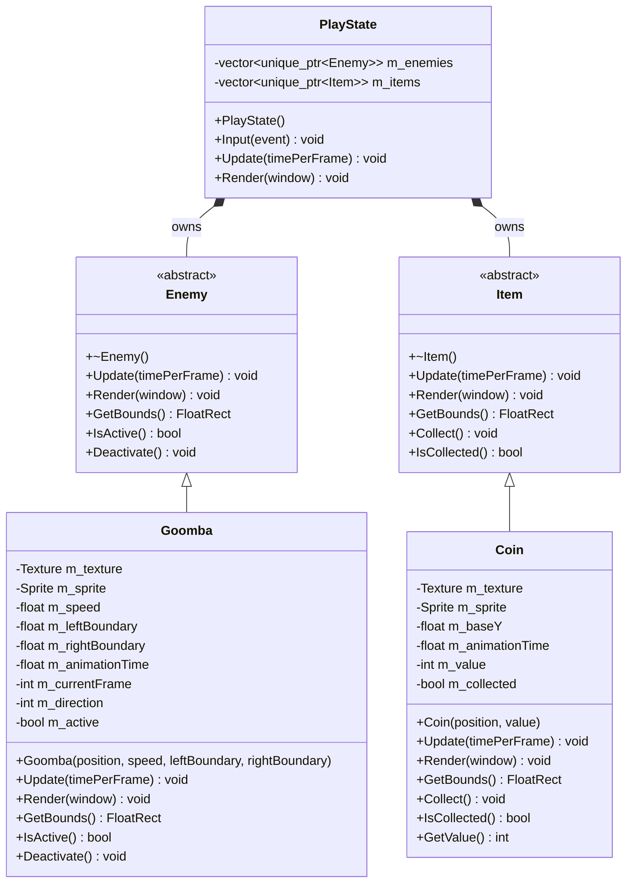
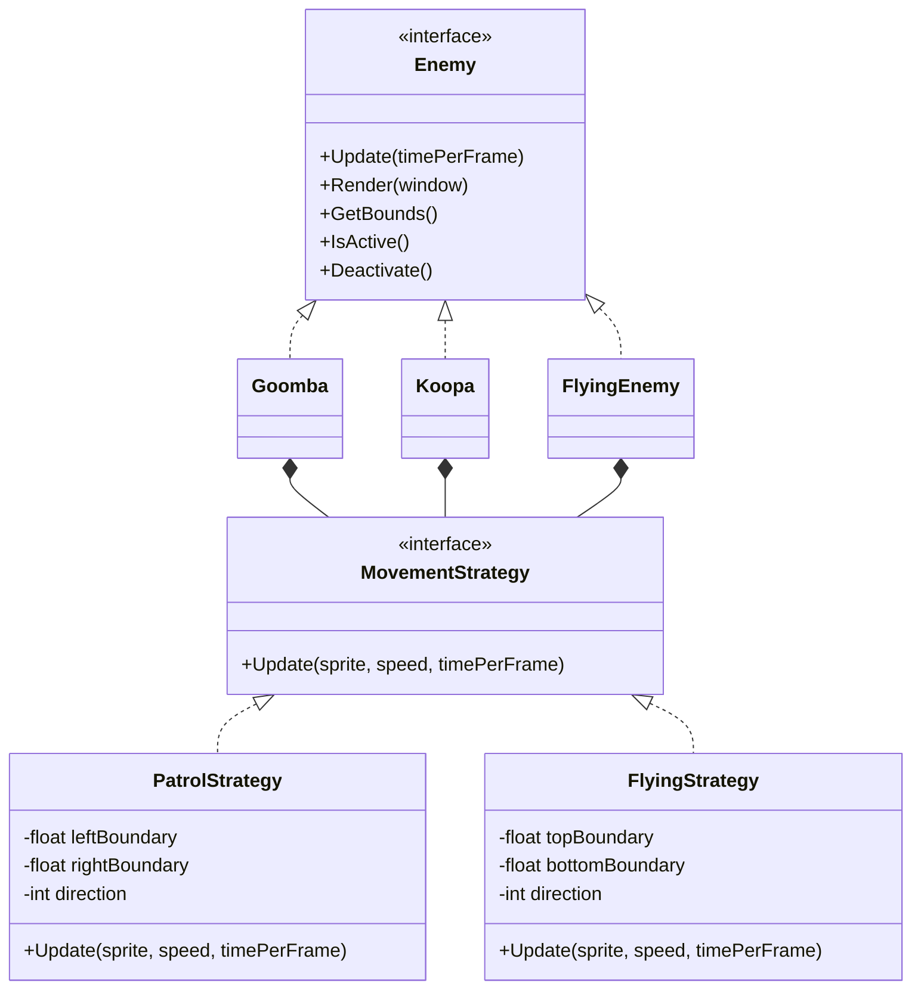

# Enemy and Item Base System

## Class Diagram

## Design Summary

`Enemy` and `Item` are abstract base classes that define common interfaces for all enemies and collectible items.

`Goomba` implements the `Enemy` interface. It moves horizontally within configured patrol boundaries and uses a two-frame walking animation.

`Coin` implements the `Item` interface. It has a collection state, point value, sprite rendering, and a floating idle animation.

`PlayState` stores enemies and items through `std::unique_ptr` collections. Update and render operations are called through base-class pointers, demonstrating runtime polymorphism.

Inactive enemies and collected items are removed safely from their corresponding vectors using `std::remove_if`.

## Enemy Movement Strategy

The enemy system applies the Strategy Pattern to separate movement behavior
from concrete enemy classes.

### Current Enemy Behaviors

- `Goomba` uses `PatrolStrategy` and moves horizontally.
- `Koopa` uses `PatrolStrategy` but moves more slowly than Goomba.
- `FlyingEnemy` uses `FlyingStrategy` and moves vertically.
- Movement behavior is injected through `std::unique_ptr<MovementStrategy>`.
- Concrete enemy classes do not contain patrol boundary logic directly.

### Strategy Pattern Purpose

The Strategy Pattern allows each enemy to use a reusable movement algorithm.
New movement strategies can be added without changing the `Enemy` interface or
rewriting existing enemy classes.

For example:

- Ground enemies can use `PatrolStrategy`.
- Flying enemies can use `FlyingStrategy`.
- Future enemies may use `ChaseStrategy` or `BossStrategy`.