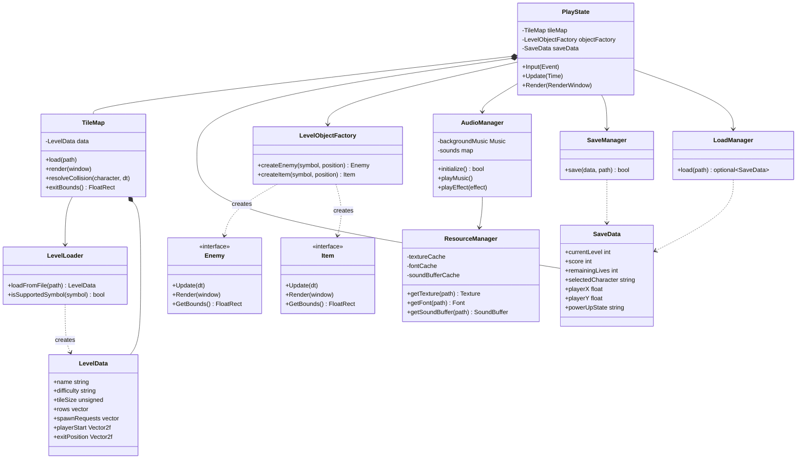

# Member 4 class diagram

```mermaid
classDiagram
    direction TB

    class PlayState {
        -TileMap tileMap
        -LevelObjectFactory objectFactory
        -SaveData saveData
        +Input(Event)
        +Update(Time)
        +Render(RenderWindow)
    }

    class LevelLoader {
        +loadFromFile(path) LevelData
        +isSupportedSymbol(symbol) bool
    }

    class LevelData {
        +name string
        +difficulty string
        +tileSize unsigned
        +rows vector
        +spawnRequests vector
        +playerStart Vector2f
        +exitPosition Vector2f
    }

    class TileMap {
        -LevelData data
        +load(path)
        +render(window)
        +resolveCollision(character, dt)
        +exitBounds() FloatRect
    }

    class LevelObjectFactory {
        +createEnemy(symbol, position) Enemy
        +createItem(symbol, position) Item
    }

    class Enemy {
        <<interface>>
        +Update(dt)
        +Render(window)
        +GetBounds() FloatRect
    }

    class Item {
        <<interface>>
        +Update(dt)
        +Render(window)
        +GetBounds() FloatRect
    }

    class ResourceManager {
        -textureCache
        -fontCache
        -soundBufferCache
        +getTexture(path) Texture
        +getFont(path) Font
        +getSoundBuffer(path) SoundBuffer
    }

    class AudioManager {
        -backgroundMusic Music
        -sounds map
        +initialize() bool
        +playMusic()
        +playEffect(effect)
    }

    class SaveData {
        +currentLevel int
        +score int
        +remainingLives int
        +selectedCharacter string
        +playerX float
        +playerY float
        +powerUpState string
    }

    class SaveManager {
        +save(data, path) bool
    }

    class LoadManager {
        +load(path) optional~SaveData~
    }

    PlayState *-- TileMap
    PlayState *-- SaveData
    PlayState --> LevelObjectFactory
    TileMap --> LevelLoader
    LevelLoader ..> LevelData : creates
    TileMap *-- LevelData
    LevelObjectFactory ..> Enemy : creates
    LevelObjectFactory ..> Item : creates
    AudioManager --> ResourceManager
    PlayState --> AudioManager
    PlayState --> SaveManager
    PlayState --> LoadManager
    SaveManager ..> SaveData
    LoadManager ..> SaveData
```

`LevelSpawnRequest` is contained by `LevelData` and is the neutral handoff
between parsing and factory creation.
