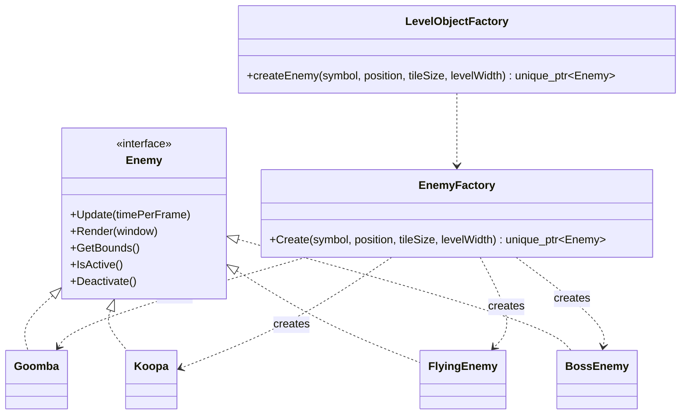

# Enemy Factory System

## Overview

The enemy system applies the Factory Pattern to create concrete enemy objects
from level-map symbols.

`EnemyFactory` returns `std::unique_ptr<Enemy>`, allowing the level and gameplay
systems to store and process all enemies through the common `Enemy` interface.

## Supported Enemy Types

| Symbol | Enemy | Movement behavior |
|---|---|---|
| `G` | `Goomba` | Horizontal patrol |
| `K` | `Koopa` | Slower horizontal patrol |
| `E` | `FlyingEnemy` | Vertical flying movement |
| `B` | `BossEnemy` | Boss patrol behavior |

## Factory Flow

```text
Level file symbol
        |
        v
LevelObjectFactory
        |
        v
EnemyFactory::Create()
        |
        v
Concrete Enemy object
        |
        v
std::unique_ptr<Enemy>
```

## Class Diagram



## Level-Aware Creation

The factory receives:

- Enemy symbol.
- Spawn position.
- Tile size.
- Level width.

These values are used to calculate valid movement boundaries without placing
enemy-construction logic inside `PlayState` or `LevelObjectFactory`.

## Benefits

- Enemy construction is centralized.
- Level data controls which enemy type is created.
- Gameplay code depends on the `Enemy` abstraction.
- New enemy types can be added through a new map symbol.
- Patrol and flying behaviors remain separated through the Strategy Pattern.