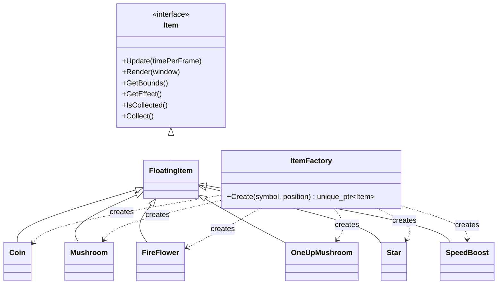

# Item Factory and Power-Up System

## Overview

The item system uses inheritance and runtime polymorphism to manage different
collectable objects through the common `Item` interface.

The currently supported item types are:

- `Coin`
- `Mushroom`
- `FireFlower`
- `OneUpMushroom`
- `Star`
- `SpeedBoost`

All items implement common update, render, collision-bound, collection, and
effect operations.

## Item Effect Contract

Each concrete item returns an `ItemEffect` object through:

```cpp
virtual ItemEffect GetEffect() const = 0;
```

The current effect types are:

| Item | Effect type | Result |
|---|---|---|
| Coin | `AddScore` | Increases the player's score |
| Mushroom | `GrowPlayer` | Grants a one-hit shield |
| FireFlower | `EnableFirePower` | Grants a one-hit shield and fire state |
| OneUpMushroom | `ExtraLife` | Adds one life |
| Star | `Invincibility` | Defeats enemies on contact for eight seconds |
| SpeedBoost | `SpeedBoost` | Raises movement speed for eight seconds |

The actual effect will be applied during player-item collision integration.

## Factory Pattern

`ItemFactory` creates concrete item objects from map symbols.



## Supported Map Symbols

| Symbol | Created item |
|---|---|
| `C` | `Coin` |
| `M` | `Mushroom` |
| `F` | `FireFlower` |
| `L` | `OneUpMushroom` |
| `S` | `Star` |
| `V` | `SpeedBoost` |

Example:

```cpp
std::unique_ptr<Item> item =
    ItemFactory::Create('M', position);
```

`PlayState` stores the result as `std::unique_ptr<Item>`, so it does not need
to depend directly on concrete item classes.

## Benefits

- Concrete item construction is centralized.
- `PlayState` does not contain direct `make_unique` calls for item subclasses.
- Level files can create items using simple symbols.
- New item types can be added with minimal changes.
- All item types are processed polymorphically through the `Item` interface.
