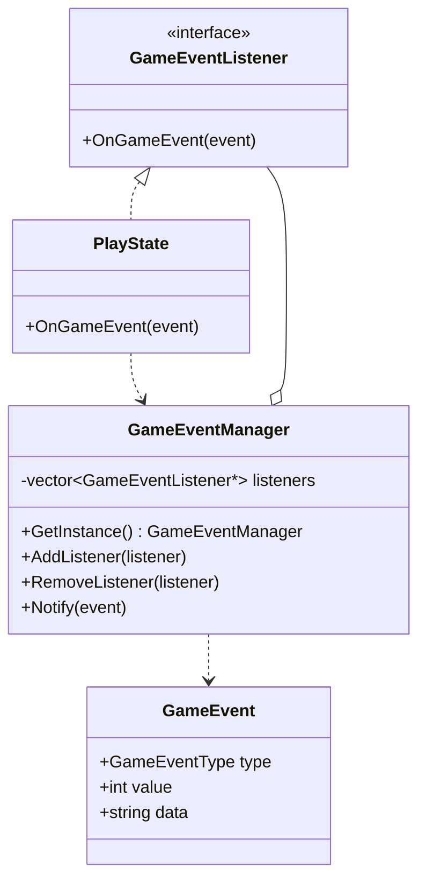

# Observer Pattern for Gameplay Events

## Overview

The gameplay system applies the Observer Pattern to separate gameplay actions
from score, lives, power-up, sound, status-message, and HUD updates.

Gameplay systems publish `GameEvent` objects through `GameEventManager`.
Registered listeners receive those events through the `GameEventListener`
interface.

## Main Components

### GameEvent

`GameEvent` contains the information describing a gameplay action.

```cpp
struct GameEvent {
    GameEventType type;
    int value = 0;
    std::string data;
};
```

Supported event types:

- `CoinCollected`
- `PowerUpCollected`
- `EnemyDefeated`
- `PlayerDamaged`
- `LevelCompleted`

### GameEventListener

Classes that need to react to gameplay events implement:

```cpp
virtual void OnGameEvent(
    const GameEvent& event
) = 0;
```

`PlayState` currently implements this interface.

### GameEventManager

`GameEventManager` acts as the event subject.

Its responsibilities are:

- Register listeners.
- Remove listeners.
- Publish events to registered listeners.
- Prevent duplicate listener registration.

## Class Diagram



## Event Flow

### Item Collection

```text
Player collides with Item
        |
        v
Item returns ItemEffect
        |
        v
GameEventManager publishes event
        |
        v
PlayState receives event
        |
        v
Score / power-up / sound / HUD are updated
```

### Enemy Collision

```text
Player stomps enemy
        |
        v
Enemy becomes inactive
        |
        v
EnemyDefeated event is published
        |
        v
Score, sound, status message, and HUD are updated
```

If the player touches an enemy from the side, a `PlayerDamaged` event is
published and the player loses one life.

### Level Events

- Falling outside the level publishes `PlayerDamaged`.
- Reaching a valid level exit publishes `LevelCompleted`.
- Completing a level increases the score through the event listener.

## Benefits

- Collision functions do not directly manage all UI and game-state updates.
- Score, lives, power-ups, sound, and HUD behavior are centralized.
- New listeners can be added without changing the event publishers.
- Gameplay systems are less tightly coupled.
- Event handling can be expanded for achievements, statistics, or additional UI.